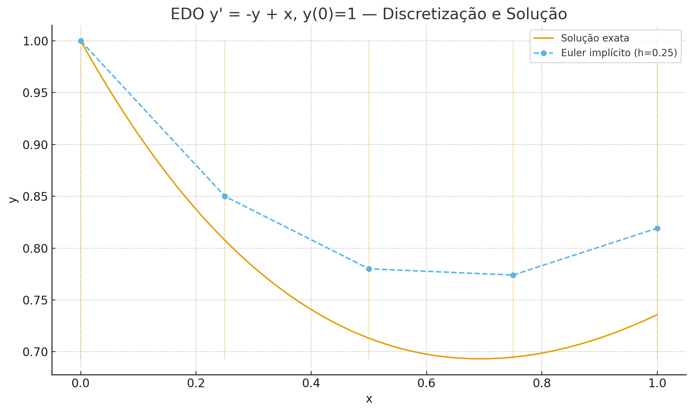

# CB0589 ÁLGEBRA LINEAR

## Álgebra de Matrizes e Invertibilidade

---

## **O que é uma Matriz?**

Uma matriz é um arranjo retangular de números, símbolos ou expressões, organizados em linhas e colunas.

**Representação:**
Uma matriz $A$ com $m$ linhas e $n$ colunas (ordem $m \times n$) é representada como:

$$
A = (a_{ij})_{m \times n} =
\begin{bmatrix}
a_{11} & a_{12} & \dots & a_{1n} \\
a_{21} & a_{22} & \dots & a_{2n} \\
\vdots & \vdots & \ddots & \vdots \\
a_{m1} & a_{m2} & \dots & a_{mn}
\end{bmatrix}
$$

O elemento $a_{ij}$ está na linha $i$ e na coluna $j$.

---

Uma **matriz** também pode ser formalmente definida como uma **função** que associa cada par ordenado de índices a um número (ou elemento) em um conjunto, como os números reais.

Seja $I = \{1, 2, \ldots, m\}$ e $J = \{1, 2, \ldots, n\}$ os conjuntos de índices das linhas e colunas, respectivamente.

Chamamos matriz $A$ de ordem $m \times n$ a função:

$$
A: I \times J \to \mathbb{R}
$$

tal que, para cada par $(i,j)$ com $i \in I$ e $j \in J$, temos um elemento $a_{ij} = A(i,j)$.

---

### **Interpretação**

* $i$ indica a **linha** e $j$ indica a **coluna**.
* O valor $a_{ij}$ é o **elemento da matriz** na posição $(i,j)$.
* Assim, a matriz nada mais é do que uma **tabela organizada** de valores, mas formalmente descrita como uma função de dois índices.

Por exemplo, para uma matriz $2 \times 3$:

$$
A = \begin{bmatrix}
a_{11} & a_{12} & a_{13} \\
a_{21} & a_{22} & a_{23}
\end{bmatrix},
$$

temos:

* $I = \{1,2\}$,
* $J = \{1,2,3\}$,
* e cada entrada $a_{ij}$ é dada por $A(i,j)$.

---

### **Exemplos:**

$$A:\{1,2\}\times\{1,2,3\}\to\mathbb{R}, \;\;\;A(i,j) = i +2j$$
 

$$A = \begin{bmatrix}
3 & 5 & 7 \\
4 & 6 & 8
\end{bmatrix}$$

 

$$I_n:\{1,\ldots,n\}\times\{1,\ldots,n\}\to\mathbb{R}, \;\;\;A(i,j) = \delta_{ij}$$
 

$$I_3 = \begin{bmatrix}
1 & 0 & 0 \\
0 & 1 & 0 \\
0 & 0 & 1
\end{bmatrix}$$

---

## **Definição: Adição e Subtração de Matrizes**

Sejam $A=(a_{ij})$ e $B=(b_{ij})$ duas matrizes de mesma ordem $m \times n$.

- A **soma** $A+B$ é a matriz $C=(c_{ij})$ de ordem $m \times n$ onde cada elemento é a soma dos elementos correspondentes:
  $$c_{ij} = a_{ij} + b_{ij}$$

- A **diferença** $A-B$ é definida de forma análoga:
  $$(A - B)_{ij} = a_{ij} - b_{ij}$$

---

### Exemplo: Adição e Subtração

Sejam
$$
A=\begin{bmatrix}1&2\\3&4\end{bmatrix},\quad
B=\begin{bmatrix}5&6\\7&8\end{bmatrix}
$$

**Soma:**
$$
A+B=\begin{bmatrix}1+5&2+6\\3+7&4+8\end{bmatrix}
=\begin{bmatrix}6&8\\10&12\end{bmatrix}
$$

**Subtração:**
$$
A-B=\begin{bmatrix}1-5&2-6\\3-7&4-8\end{bmatrix}
=\begin{bmatrix}-4&-4\\-4&-4\end{bmatrix}
$$

---

## **Definição: Multiplicação por Escalar**
 

Seja $A=(a_{ij})$ uma matriz de ordem $m \times n$ e $k$ um número real (escalar).

 

- O **produto por escalar** $kA$ é a matriz $C=(c_{ij})$ de ordem $m \times n$ onde cada elemento é o produto do elemento correspondente de $A$ pelo escalar $k$:
  $$c_{ij} = k \cdot a_{ij}$$

---

### Exemplo: Multiplicação por Escalar

Seja a matriz $A$ e o escalar $k = 3$:
$$
A = \begin{bmatrix} 1 & 2 \\ 3 & 4 \end{bmatrix}
$$

**Multiplicação ($k A$):**
$$
3A = \begin{bmatrix} 3 \cdot 1 & 3 \cdot 2 \\ 3 \cdot 3 & 3 \cdot 4 \end{bmatrix} = \begin{bmatrix} 3 & 6 \\ 9 & 12 \end{bmatrix}
$$

---

## **Matriz × Vetor (coluna única)**

Se $A=[\,a_1\ \cdots\ a_n\,]\in\mathbb{R}^{m\times n}$ e $x=\begin{bmatrix}x_1\\ \vdots\\ x_n\end{bmatrix}\in\mathbb{R}^n$, então
$$
Ax=\sum_{k=1}^n x_k\,a_k \;\in\; \mathbb{R}^m.
$$

 

**$Ax$ é combinação linear das colunas** de $A$ com pesos dados pelas entradas de $x$.

---

###  Exemplo: 
 

**Dimensões:** $A\in\mathbb{R}^{m\times n}$, $x\in\mathbb{R}^n \Rightarrow Ax\in\mathbb{R}^m$.

 

$$
A=\begin{bmatrix}1&2\\3&4\\5&6\end{bmatrix},\quad
x=\begin{bmatrix}2\\-1\end{bmatrix}
\Rightarrow\ 
Ax=2\!\begin{bmatrix}1\\3\\5\end{bmatrix}-1\!\begin{bmatrix}2\\4\\6\end{bmatrix}
=\begin{bmatrix}0\\2\\4\end{bmatrix}.
$$

---

## **Vetor (linha única) × Matriz**

 

Se $A = [\,a_1\ \cdots\ a_m\,]\in\mathbb{R}^{m\times n}$ (linhas) e $y=\begin{bmatrix}y_1&\cdots&y_m\end{bmatrix}\in\mathbb{R}^{1\times m}$, então
 

$$
y A=\sum_{i=1}^m y_i\,a_i \;\in\; \mathbb{R}^{1\times n},
$$
 

isto é, **$yA$ é combinação linear das linhas** de $A$ com pesos dados pelas entradas de $y$.

---

### Exemplo:  
 

**Dimensões:** $y\in\mathbb{R}^{1\times m}$, $A\in\mathbb{R}^{m\times n} \Rightarrow yA\in\mathbb{R}^{1\times n}$.

 

$$
y=\begin{bmatrix}1&-2&0\end{bmatrix},\ 
A=\begin{bmatrix}1&2\\3&4\\5&6\end{bmatrix}
\Rightarrow\ 
y A=1\!\begin{bmatrix}1&2\end{bmatrix}-2\!\begin{bmatrix}3&4\end{bmatrix}
=\begin{bmatrix}-5&-6\end{bmatrix}.
$$

---

## **Definição: Multiplicação de Matrizes**

Seja $A=(a_{ij})$ uma matriz de ordem $m \times n$ e $B=(b_{ij})$ de ordem $n \times p$.

- O **produto** $AB$ é a matriz $C=(c_{ij})$ de ordem $m \times p$.
- O elemento $c_{ij}$ é obtido pela soma dos produtos dos elementos da linha $i$ de $A$ pelos elementos da coluna $j$ de $B$:
  $$c_{ij} = \sum_{k=1}^{n} a_{ik}b_{kj}$$

**Atenção:** O número de colunas da primeira matriz deve ser igual ao número de linhas da segunda.

---

## Calculando AB

---

### Exemplo: Multiplicação de Matrizes

 

$$
A_{2 \times 2} = \begin{bmatrix} 1 & 2 \\ 3 & 4 \end{bmatrix}, \quad B_{2 \times 2} = \begin{bmatrix} 5 & 6 \\ 7 & 8 \end{bmatrix}
$$
$$
C = AB = \begin{bmatrix} (1\cdot5+2\cdot7) & (1\cdot6+2\cdot8) \\ (3\cdot5+4\cdot7) & (3\cdot6+4\cdot8) \end{bmatrix} = \begin{bmatrix} 19 & 22 \\ 43 & 50 \end{bmatrix}
$$

 

**A multiplicação de matrizes NÃO é comutativa!**
 
$$
BA = \begin{bmatrix} (5\cdot1+6\cdot3) & (5\cdot2+6\cdot4) \\ (7\cdot1+8\cdot3) & (7\cdot2+8\cdot4) \end{bmatrix} = \begin{bmatrix} 23 & 34 \\ 31 & 46 \end{bmatrix} \neq AB
$$

---

## **Interpretação do Produto: Combinação de Colunas**
 

Se $A\in\mathbb{R}^{m\times n}$ e $B=[\,b_1\ \cdots\ b_p\,]\in\mathbb{R}^{n\times p}$ com $b_j$ colunas,
 

$$
AB=\big[\,A b_1\ \cdots\ A b_p\,\big],\qquad
A b_j=\sum_{k=1}^{n} b_{kj}\, a_k,
$$
 

onde $a_k$ é a $k$-ésima **coluna** de $A$.

---

### Exemplo:  
$$
A=\begin{bmatrix}1&0\$$2pt]2&1\$$2pt]0&1\end{bmatrix},\
B=\begin{bmatrix}2&-1\$$2pt]3&4\end{bmatrix}
\Rightarrow
a_1=\begin{bmatrix}1\\2\\0\end{bmatrix},\ a_2=\begin{bmatrix}0\\1\\1\end{bmatrix}
$$

$$
AB=\big[\,2a_1+3a_2\ \ \ -a_1+4a_2\,\big]
=\begin{bmatrix}2&-1\$$2pt]7&2\$$2pt]3&4\end{bmatrix}.
$$

---

## **Definição: Matriz Transposta**

Seja $A=(a_{ij})$ uma matriz de ordem $m \times n$.

 

- A **matriz transposta** de $A$, denotada por $A^T$, é a matriz de ordem $n \times m$ obtida pela troca de linhas por colunas:
 
$$(A^T)_{ij} = a_{ji}$$

---

### Exemplo: Matriz Transposta

$$
A = \begin{bmatrix} 1 & 2 & 3 \\ 4 & 5 & 6 \end{bmatrix} \implies A^T = \begin{bmatrix} 1 & 4 \\ 2 & 5 \\ 3 & 6 \end{bmatrix}
$$

**Propriedades:**
- $(A^T)^T = A$
- $(A + B)^T = A^T + B^T$
- $(kA)^T = k A^T$
- $(AB)^T = B^T A^T$

---

## **Definição: Matriz Identidade**

**Matriz Identidade ($I_n$):**
É a matriz quadrada de ordem $n$ que é o elemento neutro da multiplicação:
 
$$AI_n = I_n A = A$$
 

$$ (I_n)_{ij} = \delta_{ij} = \begin{cases} 1 & \text{se } i=j \\ 0 & \text{se } i \neq j \end{cases} $$

---

## **Definição: Matriz Inversa ($A^{-1}$)**

Uma matriz quadrada $A$ de ordem $n$ é **invertível** (ou não singular) se existe matriz $A^{-1}$ de ordem $n$ tal que:
 
$$A A^{-1} = A^{-1} A = I_n$$
 

Se tal matriz $A^{-1}$ não existe, $A$ é dita **não invertível** (ou singular). Uma condição necessária e suficiente para $A$ ser invertível é que $\det(A) \neq 0$.

---

## **Teoremas e Propriedades da Matriz Inversa**

Para matrizes $A$ e $B$ invertíveis de mesma ordem $n$, e um escalar $k \neq 0$:

1.  **Unicidade da Inversa:** Se uma matriz tem inversa, ela é única.
 
2.  **Inversa de um Produto:** O produto $AB$ também é invertível, e sua inversa é:
    $$(AB)^{-1} = B^{-1}A^{-1}$$
 

3.  **Inversa da Transposta:** A transposta de uma matriz invertível também é invertível, e sua inversa é:
    $$(A^T)^{-1} = (A^{-1})^T$$

---

4.  **Inversa da Inversa:** A inversa da inversa de uma matriz é a própria matriz:
    $$(A^{-1})^{-1} = A$$ 
     

5.  **Inversa de um Múltiplo Escalar:** A matriz $kA$ é invertível, e sua inversa é:
    $$(kA)^{-1} = \frac{1}{k}A^{-1}$$

---

### Exemplo: Identidade e Inversa

A identidade de ordem 2 é $I_2 = \begin{bmatrix} 1 & 0 \\ 0 & 1 \end{bmatrix}$.

Dada a matriz $A = \begin{bmatrix} 2 & 5 \\ 1 & 3 \end{bmatrix}$, sua inversa é $A^{-1} = \begin{bmatrix} 3 & -5 \\ -1 & 2 \end{bmatrix}$.

**Verificação:**
$$
AA^{-1} = \begin{bmatrix} 2 & 5 \\ 1 & 3 \end{bmatrix} \begin{bmatrix} 3 & -5 \\ -1 & 2 \end{bmatrix} = \begin{bmatrix} (6-5) & (-10+10) \\ (3-3) & (-5+6) \end{bmatrix} = \begin{bmatrix} 1 & 0 \\ 0 & 1 \end{bmatrix} = I_2
$$

---

## **Definição: Matrizes Especiais**

Uma matriz quadrada $A = (a_{ij})$ é dita:

|Classe|Definição|
|:---:|:---:|
|Diagonal|se $a_{ij} = 0$ para todo $i \neq j$|
|Triangular Superior|se $a_{ij} = 0$ para todo $i > j$|
|Triangular Inferior|se $a_{ij} = 0$ para todo $i < j$|
|Simétrica|se $A = A^T$, ou seja, $a_{ij} = a_{ji}$ para todos $i, j$|
|Ortogonal|se sua inversa é sua transposta, $A^{-1} = A^T$|

---

### Exemplos de Matrizes Especiais

| **Diagonal** | **Triangular Superior** |
|:--------------:|:--------------------------:|
| $\begin{bmatrix} 2 & 0 & 0 \\ 0 & -1 & 0 \\ 0 & 0 & 5 \end{bmatrix}$ | $\begin{bmatrix} 1 & 3 & 9 \\ 0 & 4 & -2 \\ 0 & 0 & 8 \end{bmatrix}$ |
| **Simétrica** | **Ortogonal** |
| $\begin{bmatrix} 1 & 7 & 3 \\ 7 & 4 & -5 \\ 3 & -5 & 6 \end{bmatrix}$ | $\begin{bmatrix} 0 & 1 \\ -1 & 0 \end{bmatrix}$ |

---

### Exercícios

**Dadas as matrizes:**
$$
A = \begin{bmatrix} 1 & 0 \\ 2 & 3 \end{bmatrix}, \quad B = \begin{bmatrix} -1 & 4 \\ 1 & 2 \end{bmatrix}, \quad C = \begin{bmatrix} 3 & -1 & 0 \\ 2 & 5 & -4 \end{bmatrix}
$$

**Calcule (se possível):**
1. $A + B$
2. $3A - 2B$
3. $AB$ e $BA$
4. $AC$
5. $C^T$
6. $(A + B)^T$ e $A^T + B^T$

---

# Aplicações de Matrizes

---

### Exemplo: Grafo ponderado
$G=(V,E,w)$

$V=\{1,2,3,4\}$

$E=\{e_1, e_2, e_3, e_4, e_5\}$

$w=\{w_1, w_2, w_3, w_4, w_5\}$

Arestas e pesos:
- $e_1 = \{1,1\},\; w_1=5$
- $e_2 = \{1,2\},\; w_2=3$
- $e_3 = \{1,3\},\; w_3=2$
- $e_4 = \{2,3\},\; w_4=1$
- $e_5 = \{2,4\},\; w_5=4$

---

### Representação Matricial

 

$$
B=
\begin{bmatrix}
5 & 3 & 2 & 0\\
3 & 0 & 1 & 4\\
2 & 1 & 0 & 0\\
0 & 4 & 0 & 0
\end{bmatrix}
$$

---

### Exemplo: Da EDO para um Sistema Linear

**Equação Diferencial:**
$$
\frac{dy}{dx} = -y + x, \quad y(0) = 1
$$

- Intervalo: $[0,1]$
- Dividido em 4 pontos: $x_0 = 0, \, x_1 = 0.25, \, x_2 = 0.50, \, x_3 = 0.75, \, x_4 = 1.00$
- Passo $h = 0.25$

Queremos aproximar $y(x)$ nesses pontos.

---

### Euler Implícito (Backward Euler)

Aproximação da derivada:
$$
\frac{y_{i+1}-y_i}{h} = -y_{i+1} + x_{i+1}
$$

Reorganizando:
$$
(1 + h)y_{i+1} - y_i = h x_{i+1}
$$

Essa equação é **linear** em $y_{i+1}$ e pode ser montada em um sistema.

---

### Sistema Linear Resultante

$$
\begin{bmatrix}
1+h & -1 & 0 & 0 \\
-1 & 1+h & -1 & 0 \\
0 & -1 & 1+h & -1 \\
0 & 0 & -1 & 1+h
\end{bmatrix}
\begin{bmatrix}
y_1 \\ y_2 \\ y_3 \\ y_4
\end{bmatrix}
=
h
\begin{bmatrix}
x_1 \\ x_2 \\ x_3 \\ x_4
\end{bmatrix}
+
\begin{bmatrix}
y_0 \\ 0 \\ 0 \\ 0
\end{bmatrix}
$$

Com $y_0 = 1$ e $h = 0.25$.

---

$$y(x) = x - 1 + 2e^{-x}$$

